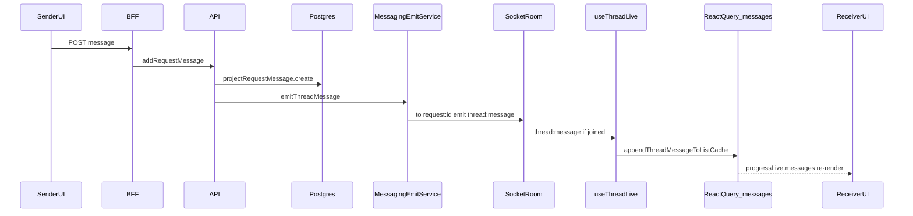

# Project thread messaging

Live messaging for project request threads (onboarding, progress, cancellation, team review, etc.) on the **admin center** and **client portal**.

Org-wide inbox chat is documented separately in [org-inbox-messaging.md](./org-inbox-messaging.md). Both surfaces share the same `@cocreate/messaging` Socket.io stack.

For a plain-English tour of every key file (no code), see [messaging-files-guide.md](./messaging-files-guide.md).

## Summary

In mid-2026 we spent significant time migrating project thread realtime from Supabase Realtime broadcast to **Socket.io on NestJS**. Message delivery still felt slow and one-way (client → admin especially). **The transport was not the root cause.**

Terminal evidence during a client send:

```
[api] MessagingEmitService thread:message <requestId>   ← API emitted immediately
client-portal POST .../messages 201 in ~2.3s          ← send path slow but OK
admin-center GET .../approvals                        ← unrelated side-effect churn
NO admin GET /api/project-requests/<id>               ← messages query never refetched
```

The API persisted messages and emitted socket events correctly. The **browser receive path** failed: the admin client often never joined the Socket.io room, or tore down its subscription before events arrived. Progress UI reads a dedicated React Query cache (`requests.messages`); when socket append was missed, there was almost no HTTP fallback—messages appeared only after tab changes, effect re-runs, or stale expiry (minutes).

## Architecture (current)



| Layer | Location |
|-------|----------|
| Socket gateway | `apps/api/src/messaging/messaging.gateway.ts` (namespace `/messaging`) |
| Emit on write | `apps/api/src/messaging/messaging-emit.service.ts` via `projects.service.ts` |
| Shared client | `packages/messaging/` (`MessagingProvider`, `useThreadLive`, `useInboxLive`) |
| Admin wiring | `apps/admin-center/lib/messaging/` |
| Client wiring | `apps/client-portal/lib/messaging/` |
| Message cache helpers | `packages/app-ui/src/thread-messages-list-cache.ts` |

**Room naming:** `request:{requestId}`  
**Events:** `thread:message`, `thread:checkpoint`, `thread:attachment`, `thread:status`

**Auth:** Supabase JWT is used only for the socket handshake (`getAdminAccessToken` / `getPortalAccessToken`). Supabase is not the message transport.

**Persistence:** Unchanged — all messages go through Nest → Prisma → Postgres.

## What broke receive (ranked)

1. **Socket room join race** — `joinThread` was a no-op when the socket was not connected yet. No pending-room queue, no flush on `connect`/`reconnect`. Hooks that mounted before the socket was ready never joined the room.

2. **Subscription churn from unstable config** — `MessagingProvider` received a new inline `config={{...}}` object every parent re-render. `useThreadLive` depended on `config` in its effect → `leaveThread` + unsubscribe + re-join on every unrelated admin re-render (approvals, unread counts, workspace state). Events were missed in those windows.

3. **Wrong HTTP fallback** — `refreshThread` in the admin project workspace invalidated `projects.workspace`, but the Progress tab displays `progressLive.messages` from `adminQueryKeys.requests.messages(requestId)`. When socket append failed, HTTP fallback could not refresh what was on screen.

4. **Side-effect storm on every inbound text message** — the `thread:message` handler invalidated approval query keys, triggering approvals refetch and more re-renders (and more churn from item 2).

5. **Perceived one-way speed** — both portals optimistically append the sender's message to the local cache immediately. The receiver depends entirely on socket append. The sending side always feels instant; the receiving side felt broken.

## What we fixed

| Fix | File(s) |
|-----|---------|
| Pending room queue + flush on socket `connect` | `packages/messaging/src/messaging-provider.tsx` |
| Stable messaging config (module-level + `useMemo`) | `apps/admin-center/lib/messaging/admin-messaging-provider.tsx`, `apps/client-portal/lib/messaging/client-messaging-provider.tsx` |
| Join/subscribe only when `connected` | `packages/messaging/src/use-thread-live.ts`, `packages/messaging/src/use-inbox-live.ts` |
| Remove approvals invalidation on `thread:message` | `packages/messaging/src/use-thread-live.ts` |
| `refreshThread` also invalidates `requests.messages` | `apps/admin-center/components/admin-project-workspace.tsx` |
| Window focus → one-shot messages refetch (safety net) | `packages/messaging/src/use-thread-live.ts` |
| Lightweight POST auth context (no full message history load) | `apps/api/src/projects/projects.service.ts` (`getRequestContextForActor`) |
| Attachment URL cache + stable fetch callbacks | `apps/client-portal/lib/projects/fetch-projects-client.ts`, `packages/app-ui/src/attachment-previews.tsx` |

## Debugging checklist

Use the **Progress** tab on both admin project workspace and client project workspace.

**Admin browser console (development):**

```
[messaging/admin] socket connected
[messaging/admin] joinThread emit <requestId>
[messaging/admin] thread:message <requestId> { messageId, cacheCount }
[admin-progress] messages length N
```

**API terminal:**

```
[MessagingEmitService] thread:message <requestId>
[MessagingGateway] socket <id> joined request:<requestId>
```

| Symptom | Likely cause |
|---------|----------------|
| API logs `thread:message`, admin console does not | Room join race or subscription churn (check join logs) |
| Console logs `thread:message` + rising `cacheCount`, UI stale | `parentOwnsMessages` / wrong query key feeding the thread component |
| Message appears only after tab switch or long wait | Socket missed; fallback refetch never targeted `requests.messages` (pre-fix) |
| Sender instant, receiver slow | Optimistic send on sender; receiver socket path (expected asymmetry until receive works) |
| Admin Internal Server Error after dev work | Corrupted Turbopack cache — see below |

**Do not** delete `apps/admin-center/.next` while `pnpm dev` is running. That corrupts Turbopack's cache (`ENOENT build-manifest.json`). Stop dev first, then `rm -rf apps/admin-center/.next`, then restart.

## Progress tab ownership pattern

On the Progress tab, the **workspace** owns live data:

- `useAdminThreadLive` / `useClientThreadLive` at workspace level
- `RequestMessageThread` receives `parentOwnsMessages` + `liveMessages` props
- Child thread component does not run its own socket subscription for that path

Other surfaces (collaborate view, client workspace inbox list, onboarding tab) may own `useThreadLive` inside the thread component directly.

## Related docs

- [org-inbox-messaging.md](./org-inbox-messaging.md) — org-wide inbox (same `@cocreate/messaging` package, `useInboxLive`, room `inbox:{conversationId}`)
