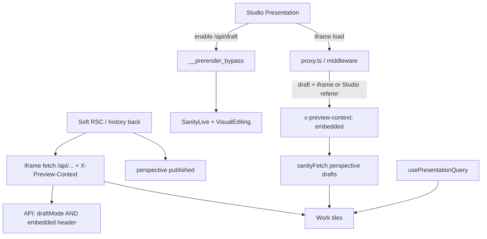

# Sanity Presentation war stories (CoCreate)

**Copy this playbook to the next repo.** It is the hard-won outcome of weeks of draft leaks, empty grids, 10s delays, 404s, and remount hell on CoCreate Work/Home Presentation. Canonical reference implementation: **joh-webapp**. Setup docs: [sanity-preview.md](./sanity-preview.md).

If you invent new draft cookies, “smart” soft-nav exceptions, or Link↔`<a>` swaps to “fix” preview, you will re-enter this hell.

---

## Golden rules (print these)

1. **Unpublished must never appear on the live site.** Non-negotiable.
2. **Copy joh first.** Do not invent CoCreate-only draft machinery.
3. **Two signals for draft SSR content:** `draftMode()` **and** `x-preview-context: embedded`.
4. **Set `embedded` only for:** draft cookie + (`sec-fetch-dest: iframe` **or** Studio referer). Soft-nav / RSC alone is **never** enough.
5. **Mount `SanityLive` / VisualEditing on `draftMode()` alone** (joh). Gate **page data** on the dual signal. Do **not** unmount Live when soft-nav loses `embedded` — that kills `usePresentationQuery`.
6. **VisualEditing** only renders when `window.self !== window.top`.
7. **Embedded array items are not documents.** One page doc in Presentation (`workPage` / `aboutPage`); projects and testimonials are array objects. Map `/work` **and** `/work/:slug` → `workPage`; map `/about` → `aboutPage`.
8. **Do not swap DOM element types** for Presentation nav (Link↔`<a>`). That breaks CSS radius / layout effects. Keep `<Link>`; hard-nav with `preventDefault` + `location.assign` when needed.
9. **`usePresentationQuery` defaults to a 10s first heartbeat** in `next-sanity` — patch it or accept empty SSR until then.
10. **Soft history (detail → index) will drop draft SSR.** Refill with joh’s client fetch + `X-Preview-Context: embedded` from the iframe (see FX rates), not by widening the proxy.

---

## Architecture that finally worked



| Concern | Gate |
|--------|------|
| Live / Visual Editing mount | `draftMode().isEnabled` |
| Page SSR draft content | `draftMode` + proxy `x-preview-context: embedded` |
| Client API draft content (soft-back refill) | `draftMode` + request header `X-Preview-Context: embedded` (set only when `window.self !== window.top`) |
| Public site | `perspective: published` + `publishedAt <= now()`; never OR `drafts.*` into GROQ |

---

## Problem → root cause → final fix

### 1. Unpublished tiles flash / stick on the live site

**Symptom:** Draft projects appear (or flicker) on the public marketing origin.

**Wrong turns:**
- OR-ing `drafts.workPage` into public GROQ
- Treating soft-nav + leftover `__prerender_bypass` as preview
- Inventing a second cookie (`__sanity_presentation`) so soft-nav stayed draft — that **reopened the leak**
- Auto-redirecting every top-level `document` nav to `/api/draft/disable` (fought Presentation and confused everything)

**Final fix:**
- joh dual gate in [`apps/web/proxy.ts`](../apps/web/proxy.ts)
- [`getSanityPreviewContext()`](../apps/web/lib/preview-context.ts) = draftMode && embedded
- Published client: `perspective: 'published'`, GROQ `publishedAt` filters, post-fetch defense
- Leftover draft cookie alone → published content

---

### 2. Presentation hangs / “Loading forever” / tiles vanish after one edit

**Symptom:** Edit in Studio → iframe refresh → empty grid or infinite loading.

**Root cause:** Soft-nav after edit dropped `embedded` → we also **unmounted `SanityLive`** when embedded was missing → `usePresentationQuery` never heartbeats (`perspective` stuck `checking`) → empty SSR + no live query.

**Final fix:**
- Mount Live/VE on `draftMode()` (joh layout), **not** on embedded
- Keep content fetches on embedded only
- Do **not** invent session cookies to “fix” soft-nav SSR

---

### 3. Projects take ~10 seconds to appear in Presentation

**Symptom:** One draft tile appears only after ~10s. Server `/work` is fast (~200–500ms).

**Root cause:** `next-sanity` `usePresentationQuery` uses:

```js
const LISTEN_HEARTBEAT_INTERVAL = 10_000
setInterval(() => handleQueryHeartbeat(comlink), LISTEN_HEARTBEAT_INTERVAL)
// no immediate call → first Studio listen waits a full interval
```

Felt when SSR is published-empty (unpublished-only content) and the grid waits on the live query.

**Final fix:**
- `pnpm` patch [`patches/next-sanity@12.4.5.patch`](../patches/next-sanity@12.4.5.patch)
- Immediate `handleQueryHeartbeat(comlink)` + re-run when `perspective` leaves `checking`
- Registered in [`pnpm-workspace.yaml`](../pnpm-workspace.yaml) `patchedDependencies`

Bump `next-sanity` carefully — re-apply or drop the patch after upstream fixes this.

---

### 4. Click project in Presentation → 404

**Symptom:** Tile click opens `/work/[slug]` → not found. Unpublished projects only.

**Root cause:** Next `<Link>` soft-nav → no iframe / Studio referer → `preview=false` → published GROQ + `publishedAt` filter → miss → `notFound()`.

**Final fix:**
- Map `/work/:slug` → `workPage` in [`presentation/resolve.ts`](../apps/cocreate-webapp-studio/presentation/resolve.ts) (keep form focused; projects are objects, not docs)
- In Presentation iframe: hard-nav with `onClick` → `preventDefault()` + `location.assign(href)` while **keeping** `<Link>` in the DOM
- `stegaClean` slugs before building hrefs (stega poisons URLs)

---

### 5. Back from project detail → Work empty; Landing → Work works

**Symptom:** Detail → back = blank grid. Home → Work = fine. Structure → Presentation remount fixes it.

**Root cause:** Soft history back = published SSR (`items=[]`). `usePresentationQuery` often stays null on that remount. Landing → Work is a full iframe load → embedded SSR.

**Final fix (joh FX pattern):**
- [`GET /api/work/projects`](../apps/web/app/api/work/projects/route.ts): drafts only if `draftMode` && `X-Preview-Context: embedded`
- [`WorkCmsProvider`](../apps/web/components/work/work-cms-provider.tsx): when `window.self !== window.top` and SSR empty, fetch that API with the header; prefer Presentation query when it arrives
- Live site never sends the header → published only even with a leftover draft cookie

---

### 6. Tile border-radius / rounding disappeared

**Symptom:** Work tiles look square after “Presentation hard nav” work.

**Root cause:** Swapping `<Link>` ↔ `<a>` when `useIsPresentationTool()` flipped (false on SSR → true in iframe) remounted the node and raced the radius `useLayoutEffect`.

**Final fix:** Always render `<Link>`. Hard-nav only via click handler. Never change element type for preview.

---

### 7. `Cannot read properties of null (reading 'page')`

**Symptom:** Crash in Work CMS provider.

**Root cause:** `usePresentationQuery` returns `data: null` while inactive. Code checked `=== undefined` only.

**Final fix:** Guard with `presentationData == null` (null and undefined), same as landing provider.

---

### 8. Schema / migration footguns (Studio)

**Risks we hit:**
- `setIfMissing({ projects: [] })` on published after migrating into a **draft** stamped an empty published array
- Orphan-delete of legacy `workProject` docs when flag/array already existed
- Treating projects as sibling Presentation documents (wrong pane chrome, wrong `mainDocuments`)

**Final model:** One `workPage` singleton; `projects[]` objects; array order = grid order; Client as shared references; `publishedAt` gates public visibility. Same pattern for About: one `aboutPage` singleton; `testimonials[]` objects; hero image **or** Mux video; never `setIfMissing({ testimonials: [] })` on published after a draft-only migrate.

---

## Checklist for the next project

Use this before touching Presentation:

- [ ] Middleware/proxy matches joh: draft + (iframe | Studio referer) → `x-preview-context`
- [ ] Layout: Live/VE on `draftMode()`; VisualEditing iframe-only
- [ ] Page fetches: `draftMode && embedded` (helper ok)
- [ ] Published GROQ never selects `drafts.**` via OR; use `perspective: 'published'`
- [ ] Public content has an explicit publish field (`publishedAt`) if drafts live inside a published parent doc
- [ ] `mainDocuments` cover every preview URL (including nested slugs → parent page type)
- [ ] Array/object content (FX rows, work projects): one document in the pane, not N documents
- [ ] Soft-nav refill: client `fetch` + `X-Preview-Context` from iframe, dual-gated API (like joh FX)
- [ ] Patch or otherwise fix `usePresentationQuery` 10s first heartbeat if empty SSR is common
- [ ] Never Link↔`<a>` swap for preview hard-nav
- [ ] `stegaClean` anything that goes into URLs
- [ ] Guard Presentation query `data == null`
- [ ] Dataset / Doppler / preview URL secrets match Studio ↔ marketing (see [sanity-preview.md](./sanity-preview.md))

---

## Key files (CoCreate)

| Role | Path |
|------|------|
| Dual-gate proxy | `apps/web/proxy.ts` |
| Preview content helper | `apps/web/lib/preview-context.ts` |
| Layout Live/VE | `apps/web/app/layout.tsx` |
| Soft-back API | `apps/web/app/api/work/projects/route.ts` |
| Work live + refill | `apps/web/components/work/work-cms-provider.tsx` |
| Hard-nav + radius-safe tiles | `apps/web/components/work/work-tile-shell.tsx` |
| Presentation resolve | `apps/cocreate-webapp-studio/presentation/resolve.ts` |
| next-sanity heartbeat patch | `patches/next-sanity@12.4.5.patch` |
| joh middleware (source of truth) | `joh-webapp/apps/web/middleware.ts` |
| joh FX client header | `joh-webapp/apps/web/helpers/get-fx-rates.ts` |

---

## What not to do again

| Temptation | Why it burns you |
|------------|------------------|
| Soft-nav + draft cookie = embedded | Live-site draft leak / flash |
| Session cookie to “remember” Presentation | Same leak, harder to reason about |
| Unmount Live when embedded missing | Presentation hang after edit |
| Pure `draftMode()` for page SSR | Leftover cookie leaks drafts |
| OR `drafts.*` into public GROQ | Guaranteed leak |
| Custom Presentation header / multi-doc pane for array items | Fights Studio; use Add item on one doc |
| Link↔`<a>` for hard nav | Breaks CSS / hydration |
| “Just widen the proxy a little” after a soft-nav bug | Starts the leak/hang loop again |

**When stuck:** open joh-webapp About + FX Presentation paths and copy them. Do not freestyle.
