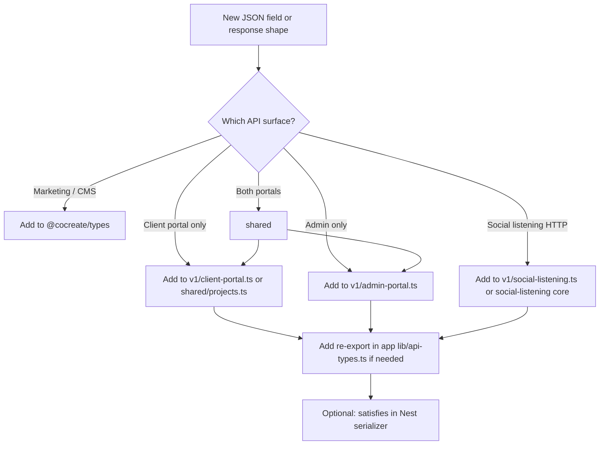

# Types and contracts

Central map for where TypeScript shapes live in the monorepo and how apps should import them.

## Package boundaries

| Package | Purpose | Import when |
|---------|---------|-------------|
| [`@cocreate/api-contracts`](../packages/api-contracts/) | Zod schemas + inferred types for Nest `/v1` request/response JSON | Fetching, validation, and typing API payloads in apps |
| [`@cocreate/social-listening`](../packages/social-listening/) | Social listening analytics domain, data-source interface, shared React UI | Client portal + admin analytics dashboards |
| [`@cocreate/social-listening-plans`](../packages/social-listening-plans/) | Plan SKUs and Fygaro billing references | Subscription billing only |
| [`@cocreate/social-listening-reports`](../packages/social-listening-reports/) | PDF report templates | Server-side report generation |
| [`@cocreate/types`](../packages/types/) | Marketing site / Sanity / search | Never for API responses |
| [`@cocreate/api-client`](../packages/api-client/) | `nestApiUrl`, version env helpers | Building Nest URLs from any app |

## `@cocreate/api-contracts` modules (v1)

| Subpath | Consumers |
|---------|-----------|
| `@cocreate/api-contracts/v1/shared/projects` | Shared enums and attachment shapes |
| `@cocreate/api-contracts/v1/shared/team` | Client/admin team hub, org roster, project members |
| `@cocreate/api-contracts/v1/shared/org-inbox` | Org-wide client ↔ agency messaging |
| `@cocreate/api-contracts/v1/client-portal` | Client portal projects, dashboard, notifications, profile, billing, org inbox |
| `@cocreate/api-contracts/v1/admin-portal` | Admin roster, projects superset, dashboard, SL admin, org inbox, auth/me |
| `@cocreate/api-contracts/v1/social-listening` | HTTP payloads (`SocialListeningAnalyticsPayload`, compare, report templates) |
| `@cocreate/api-contracts/v1/requests/*` | Request body/query Zod schemas (Nest `ZodValidationPipe`, optional client parse) |

**Note:** The package root export re-exports client-portal + shared + social-listening wire types only. Admin types must use the `v1/admin-portal` subpath (names like `ClientProjectSummary` differ between portals). Request schemas live under `v1/requests/` (e.g. `projects`, `users`, `clients`, `billing`, `social-listening`).

## Zod conventions

- **Canonical shape:** `FooSchema` in `packages/api-contracts/src/v1/schemas/` or `v1/requests/`
- **TypeScript type:** `export type Foo = z.infer<typeof FooSchema>` — same names as before for responses
- **Nest validation:** `@Body(zodBody(FooSchema)) body: FooInput` via [`apps/api/src/common/zod/zod-validation.pipe.ts`](../apps/api/src/common/zod/zod-validation.pipe.ts)
- **Wire enums:** `z.enum([...])` in contracts — keep literals in sync with Prisma (no `@cocreate/database` import in contracts)
- **Tests:** `FooSchema.parse(fixture)` in [`apps/api/src/api-contracts.contract.spec.ts`](../apps/api/src/api-contracts.contract.spec.ts)
- **Client fetch validation:** Use `parseApiResponse` / `parseApiResponseSafe` from [`apps/client-portal/lib/api/parse-response.ts`](../apps/client-portal/lib/api/parse-response.ts) at fetch boundaries for profile, team hub, projects, dashboard, files, notifications, billing, and org inbox. Parse failures log in development and return `null` (or empty arrays) consistent with network error handling.
- **Admin fetch validation:** Same helpers in [`apps/admin-center/lib/api/parse-response.ts`](../apps/admin-center/lib/api/parse-response.ts) for org inbox and team roster queries.

## Frontend data fetching

All product apps (marketing web, client-portal, admin-center) use **TanStack Query** via shared [`@cocreate/app-ui/query-provider`](../packages/app-ui/src/query-provider.tsx) (`staleTime: 60s`, devtools in development).

| App | HTTP primitive | Query layer |
|-----|----------------|-------------|
| **client-portal** | `portalFetch` in `lib/projects/fetch-projects-client.ts` | `lib/api/query-keys.ts`, `lib/api/queries/*`, `lib/api/mutations/*` |
| **admin-center** | `fetchAdminBff` in `lib/admin-api-fetch.ts` | same layout under `lib/api/` |
| **apps/api** | Nest controllers + serializers | N/A |

**Rules:**

- Components use `useQuery` / `useMutation` hooks — not inline `useEffect` fetch for API reads
- After mutations, `queryClient.invalidateQueries` with keys from `lib/api/query-keys.ts`
- Do not add Orval/codegen unless explicitly planned

## App import cheat sheet

| App | Projects / roster types | Social listening |
|-----|-------------------------|------------------|
| **client-portal** | `@/lib/projects/api-types` → re-exports `v1/client-portal` | `@cocreate/social-listening/*` (+ local fetch/data-source shims) |
| **admin-center** | `@/lib/projects/api-types`, `@/lib/dashboard/api-types` → `v1/admin-portal` | `@cocreate/social-listening/ui`, local `admin-data-source.ts` |
| **apps/api** | Serializers; contract types in key paths | `zodBody` / `zodQuery` + `import type` from `v1/social-listening`; API-local constants in `social-listening.types.ts` |

### Nest API (`apps/api`) boundary

**Do not runtime-import `@cocreate/social-listening`.** That package ships TypeScript source for React apps; loading it from Nest causes ESM resolution failures at startup.

- Use **`import type`** or **`zodBody`/`zodQuery`** with schemas from `@cocreate/api-contracts/v1/*` and `v1/requests/*`.
- Keep small runtime constants (e.g. `SENTIMENT_COLORS`) in [`apps/api/src/social-listening/social-listening.types.ts`](../apps/api/src/social-listening/social-listening.types.ts).
- Map contract subpaths via `tsconfig` paths: `@cocreate/api-contracts/v1/*` → `packages/api-contracts/src/v1/*`.

## Where to add a new API type

## Centralized wire types (client portal)

These surfaces are defined in `@cocreate/api-contracts/v1/client-portal` (and `v1/shared/team` for team primitives):

| Endpoint | Schema |
|----------|--------|
| `GET /client-portal/me` | `PortalProfileResponseSchema` |
| `GET /client-portal/team`, `/team/hub`, `/projects/:id/members` | `OrgTeamListResponseSchema`, `TeamHubResponseSchema`, `ProjectMembersResponseSchema` |
| `GET /client-portal/dashboard/recent-activity` | `ClientRecentActivityItemSchema[]` |
| `GET /client-portal/social-listening/subscription` | `ClientSubscriptionResponseSchema` |

Admin `GET .../team` uses `TeamMemberSummarySchema` (alias of `ClientTeamMemberSchema`, includes `createdAt`/`updatedAt`).

## What stays in apps (not contracts)

- BFF helpers: `fetchAdminBff`, `portalFetch`, `AdminApiFetchError`
- Session / auth: `AdminSession`, Supabase clients
- UI-only props: `*Props`, tab IDs, local grouping types
- App-specific data sources: `client-data-source.ts`, `admin-data-source.ts`, billing fetchers

## Related docs

- [API versioning](./api-versioning.md) — URI `/v1` routing and env vars
